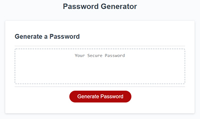

# passwordGenerator
 
## Purpose
Create an application that generates a random password based on user-selected criteria. This app will run in the browser and feature dynamically updated HTML and CSS powered by your JavaScript code. It will also feature a clean and polished user interface and be responsive, ensuring that it adapts to multiple screen sizes.

## Design:
The passwordGenerator has just one page index.html. It has style.css and script.js files as well.

The html page is designed using responsive bootstrap 4 layouts and compoents so page is responsive to screen size changes and work well on all viewport sizes and devices. The page is validated using js validation services and is free of errors and warnings.

The script.js adds the dynamic behavior to the page by quering the user regarding password criteria  such as if the user wants to include

1. lower case characters 
2. upper case characters
3. numerals
4. special characters
   
Also the script prompts the user for password length ( minumum of 8 and maximum of 128 chars).

The input is valided by script.js to see
1. password length falls within 8 and 128 , both inclusive
2. At least one character type is selected by user to include in the password.
   
If the user input passes all input validation, the user is asked to click on the 'Generate Passord' button and  a random secure password is generated satisfying user password criteria.  If user input does not meet or user cancels in between, appropriate error message is shown on screen. Also if the user goes ahead and clicks on the 'Generate Password' with invalid input appropriate error message is return and no password will be generated.

### The code repository for this work can be found at:
[repository](https://github.com/s-suresh-kumar/passwordGenerator)

### The hosted web page for this work can be found at:
[Deployed Application](https://s-suresh-kumar.github.io/passwordGenerator/)

## Usage 
Click  on [Deployed Application](https://s-suresh-kumar.github.io/passordGenerator/) to launch website to generate a secure password. Answer all the user confirms / prompts to generate the secure password. Once valid input is in place, the application displays all the password criteria chosen by the user and prompts him/herto click the "Generate Password" button. It diplays the generated secure password on the screen. If the user wants to create multiple secure passwords, he can keep clicking to generate  subsequent passwords with the same password criteria.  He can generate as many by just clicking the 'Generate Password' button. This continues until he changes the password criteria by again reloading the page. Then with new valid password criteria, one or more new secure passwrords matching the user password criteria can be generated. 

As for the password criteria, if the user is asked if user wants to include lower case characters in password, OK means it will be included and Cancel means it will be excluded. Same is true for all other character sets such as upper case, numberals and special characters as well. When it comes to password length, OK means the input password length will be honored, Cancel means , no password length provided, considered user cancel and does not want to continue with password generation.

 